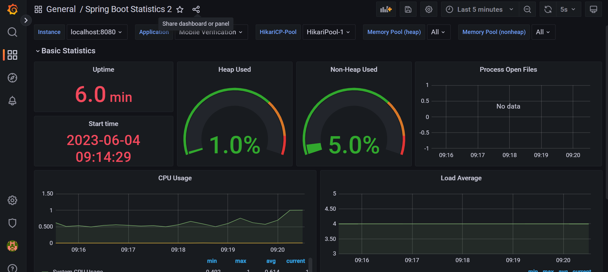

## Monitoring Application With Prometheus And Grafana

- User docker-compose file or install manually grafana and promethus
- Run the Spring boot application
- configure prometheus.yaml , copy from prometheus/config folder and paste in the prometheus base folder
- prometheus -> run prometheus.exe file
- Prometheus : http://localhost:9090
- Search the below field to see the value
  - jvm_memory_used_bytes
  - logback_events_total
  - logback_events_total{level="error"}
- grafana 
   - localhost:3000
   - username: admin
   - password: admin

    Configuring Grafana Data Source
    Let’s first add the Prometheus data source. To do that, Navigate to “add a data source”
    and select Prometheus. Then you need to only add a single property
    i.e the Prometheus URL http://localhost:9090

- Grafana will fetch prometheus info and prometheus will fetch the info from the Spring boot application using actuator endpoint
   - http://localhost:8080/actuator/info 

- Import this file `Spring Boot Statistics 2-1685859589831.json` in the grafana to see the graphs.
- 

- Custom Endpoint to monitor through MeterRegistry
  - Check GreetingController and @Timed annotation
  - 'call_greet_total` this field is to capture the value with the tag 'status'. Add stats graph in the grfana and set the query with the 'name', 'tag' and visualize the graph
  - 

